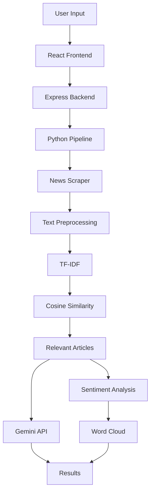

# 📰 Summora

> AI-powered news summarization platform that combines **NLP**, **Information Retrieval**, and **Generative AI** to transform lengthy news articles into concise, meaningful insights.


---

## ✨ Demo

> 

---

## 📖 About

Summora is a web application that automatically retrieves news articles from multiple online sources and generates concise AI-powered summaries.

Instead of reading multiple articles, users simply enter a keyword and select a news source. The application collects relevant articles, processes them using Natural Language Processing techniques, analyzes their sentiment, and generates a readable summary using Google's Gemini API.

---

## 🚀 Features

- 🌐 Multi-source news scraping
- 🔎 Keyword-based article retrieval
- 🧹 Automated text preprocessing
- 📊 TF-IDF vectorization
- 🎯 Cosine similarity ranking
- 😊 Sentiment analysis
- 🤖 AI-generated summaries
- ☁️ Word cloud visualization
- 💻 Responsive web interface

---

## ⚙️ How It Works

```text
User Input
     │
     ▼
Article Scraping
     │
     ▼
Text Preprocessing
     │
     ▼
TF-IDF Vectorization
     │
     ▼
Cosine Similarity Search
     │
     ▼
Relevant Articles
     │
 ┌───┴────────────┐
 ▼                ▼
Sentiment      Gemini API
Analysis       Summarization
 └──────┬─────────┘
        ▼
 Display Results
```

---

## 🛠 Tech Stack

| Category | Technologies |
|----------|--------------|
| Frontend | React, Vite, Axios, CSS |
| Backend | Node.js, Express.js |
| NLP | Python, Scikit-learn, TF-IDF, Cosine Similarity |
| AI | Gemini API |
| Data Processing | BeautifulSoup, Regex, Stopword Removal, Stemming |
| Visualization | WordCloud |

---

## 📂 Project Structure

```text
summora/
├── frontend/
├── backend/
│   ├── controllers/
│   ├── routes/
│   ├── api/
│   ├── python/
│   │   ├── batamnews/
│   │   ├── tribunnews/
│   │   └── batampos/
│   └── nlp/
│       ├── preprocess.py
│       ├── vectorizer.py
│       ├── sentiment.py
│       ├── summarizer.py
│       └── pipeline.py
└── README.md
```

---

## 🔄 Workflow



---

## 🚀 Installation

### Clone

```bash
git clone https://github.com/yourusername/summora.git
cd summora
```

### Install Frontend

```bash
cd frontend
npm install
npm run dev
```

### Install Backend

```bash
cd backend
npm install
node server.js
```

### Python Dependencies

```bash
pip install -r requirements.txt
```

---

## 🔑 Environment Variables

```env
GEMINI_API_KEY=your_api_key
PORT=5000
```

---

## 📈 Output

The application generates:

- 📄 Relevant news articles
- 🤖 AI-generated summaries
- 😊 Sentiment analysis
- ☁️ Word cloud visualization

---

## 🌱 Future Improvements

- Add more news sources
- Multi-language support
- User authentication
- Search history
- PDF export
- Real-time monitoring
- RAG-based retrieval
- Interactive analytics dashboard

---

## 👨‍💻 Author

**Krisjen Fraulein Hutagalung**

Final Project & Internship Project

⭐ If you found this project interesting, consider giving it a star!